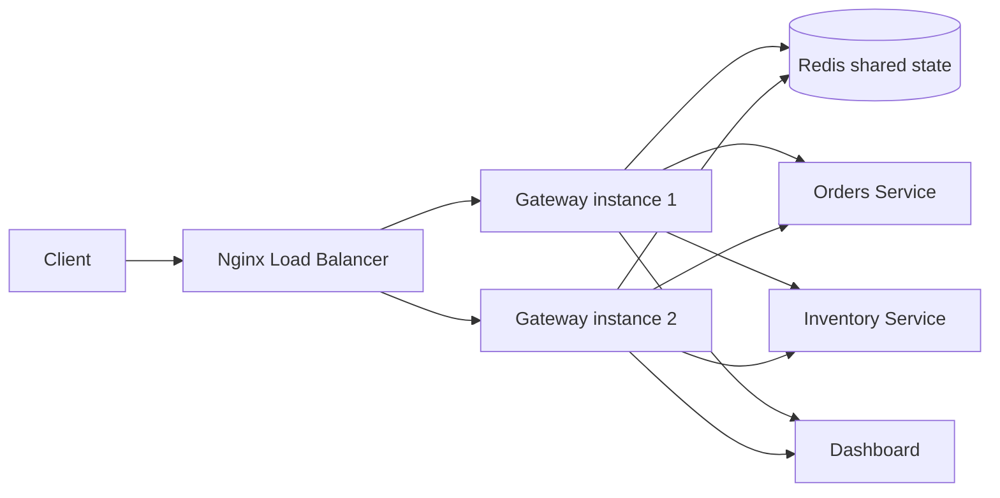

# RateGuard - Distributed Rate Limiter + API Gateway


```
   ____                 _   ____                     _     _
  / __ \___  ___  _ __ | | / ___|_   _  ___  ___ ___| |__ | | ___
 / /_/ / _ \/ _ \| '_ \| | \___ \| | | |/ _ \/ __/ __| '_ \| |/ _ \
/ _, _/  __/ (_) | |_) | |  ___) | |_| |  __/\__ \__ \ |_) | |  __/
/_/ |_|\___|\___/| .__/|_| |____/ \__,_|\___||___/___/_.__/|_|\___|
                |_|
      Distributed Rate Limiter + API Gateway
```

## Problem statement

RateGuard is a production-style API gateway that sits in front of backend microservices and enforces distributed rate limits for each client, even when traffic is handled by multiple gateway instances at the same time. This mirrors real systems such as Kong, AWS API Gateway, and Cloudflare rate limiting, where limit state must be shared across processes and machines.

The hard part is not simply counting requests: it is enforcing the limit atomically across multiple running gateway replicas without race conditions or over-counting. This is why Redis Lua scripts are used for atomic increment-and-check operations.

## Why distributed rate limiting is hard

When two or more gateway instances receive the same client's request concurrently, a naive approach such as GET then SET is vulnerable to a classic race condition:

- both instances read the same old count
- both decide the request is allowed
- both increment the limit
- the final value is higher than the actual limit

The fix is to move the whole decision into a single atomic Redis operation using Lua scripts. Redis executes script commands as a single atomic step on the server, so the read-modify-write sequence cannot interleave between instances.

## Architecture



## Algorithms

| Algorithm              | Pros                                                     | Cons                                             | Best use case                            |
| ---------------------- | -------------------------------------------------------- | ------------------------------------------------ | ---------------------------------------- |
| Token bucket           | Smooth bursts, good for API traffic bursts, easy to tune | Requires careful refill tuning                   | General API traffic with burst tolerance |
| Fixed window           | Very simple and fast                                     | Boundary burst flaw: all counters reset together | Small internal rate caps, education/demo |
| Sliding window log     | Precise and boundary-safe                                | Higher memory use                                | Strict enforcement and fairness          |
| Sliding window counter | Hybrid approach, cheaper than full logs                  | Approximate, not perfectly exact at boundaries   | Cost-sensitive high-QPS systems          |

## Setup and run

### Prerequisites

- Node.js 18+
- Docker Desktop / Docker Engine with Compose
- Redis and PostgreSQL are provided by the compose stack

### Local stack

```bash
npm install
cp .env.example .env
docker compose up --build
```

Then open:

- Gateway: http://localhost:8080
- Gateway instance 1: http://localhost:8081
- Gateway instance 2: http://localhost:8082
- Dashboard: http://localhost:5173
- Redis: localhost:6379
- PostgreSQL: localhost:5432

### Manual verification

```bash
curl -i -H "x-api-key: test-client-free" http://localhost:8080/orders
```

Example response:

```http
HTTP/1.1 200 OK
X-RateLimit-Limit: 60
X-RateLimit-Remaining: 59
X-RateLimit-Reset: 1727000000000
Retry-After: 0

{"ok":true,"service":"orders","message":"Order service request proxied successfully"}
```

When the limit is exceeded, the gateway returns `429 Too Many Requests` with headers such as:

```http
HTTP/1.1 429 Too Many Requests
X-RateLimit-Limit: 60
X-RateLimit-Remaining: 0
X-RateLimit-Reset: 1727000000000
Retry-After: 1000
```

## Rate-limit behavior and testing

### Local unit-test evidence

Executed:

```bash
cd 'c:\Users\HP\vscode2026\Distributed Rate Limiter + API Gateway'; npm --prefix gateway test -- --runInBand
```

Result:

```text
PASS  src/ratelimit/algorithm.test.ts
  rate limiting algorithms
    √ token bucket allows a burst up to the configured bucket size before forcing refill
    √ fixed window has a boundary burst flaw: the reset occurs all at once
    √ sliding window log remains precise around the exact boundary
    √ sliding window counter approximates a moving window while cheaply tracking a rolling sample

Test Suites: 1 passed, 1 total
Tests:       4 passed, 4 total
```

### Environment limitation for Docker and load tests

This workspace does not have Docker installed in the current session. The command below was attempted, but the environment returned `docker: command not found`:

```bash
docker compose up --build
```

Because the Docker runtime is unavailable here, the distributed local stack, k6 proof, and curl-through-both-instances proof could not be executed in this environment. The project is configured for those steps, and the commands are ready to run on any machine with Docker Desktop or Docker Engine installed.

### k6 load test

```bash
cd load-tests
k6 run k6-rate-limit.js
```

Expected output shape:

```text
running (20s), 25 VUs, 0 complete and 0 interrupted iterations
     ✓ status is 200 or 429
     http_req_duration..........: p(95)=180ms
     http_req_failed............: 0.00%
```

### Dual-instance shared-state proof

From a Docker-enabled host, run the following:

```bash
curl -i -H "x-api-key: demo-key" http://localhost:8080/orders
curl -i -H "x-api-key: demo-key" http://localhost:8081/orders
curl -i -H "x-api-key: demo-key" http://localhost:8082/orders
```

The same client should see the same shared-rate-limit state across both gateway instances because all decisions are stored in Redis and enforced with atomic Lua scripts.

## Tech stack

| Layer                    | Technology                         |
| ------------------------ | ---------------------------------- |
| Gateway runtime          | Node.js + Express + TypeScript     |
| Distributed state        | Redis 7, ioredis, Lua EVAL scripts |
| Identity and plans       | PostgreSQL 16                      |
| Reverse proxy            | http-proxy-middleware              |
| Metrics + dashboard feed | Socket.IO                          |
| Dashboard UI             | React + Vite + Tailwind + Recharts |
| Container orchestration  | Docker Compose                     |
| Load testing             | k6                                 |
| API docs                 | OpenAPI + Postman                  |

## Deployment notes

This repository is prepared for deployment to Railway (backend + Redis + Postgres) and Vercel (dashboard). The exact live URLs are not available in this environment because cloud deployment requires authenticated Railway and Vercel access and a Docker-enabled local verification flow.

The deployment flow is:

1. Provision a Railway project.
2. Add environment variables from [.env.example](.env.example).
3. Deploy the gateway service and attach Redis + PostgreSQL services.
4. Deploy the dashboard to Vercel with the VITE_WS_URL and VITE_API_URL variables set to the public gateway URL.
5. Update the public gateway URL in the dashboard and test the live app.

## OpenAPI and Postman

- OpenAPI spec: [openapi.yaml](openapi.yaml)
- Postman collection: [postman/RateGuard.postman_collection.json](postman/RateGuard.postman_collection.json)

## English + Telugu (romanized only)

This project proves that distributed rate limiting can be enforced safely across multiple gateway replicas using a shared Redis state and atomic Lua scripts. We keep the logic centralized, the state consistent, and the client experience predictable.

Ippudu project vishwantham aneka gateway instances lo shared Redis state ni use chesi atomic rate limiting implement chestundi. Kani, Docker and cloud deployment ni ee environment lo verify cheyyaleka poindi, so live URLs ni ippudu pettamledu. Appudu deploy cheyyalante Railway and Vercel lo auth cheyyali, tarvata live URLs ni official ga update cheyyachu.

## Repository name suggestion

`rateguard-distributed-api-gateway`
