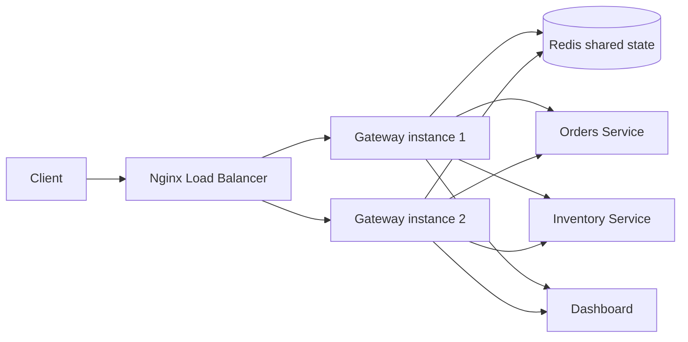

# RateGuard - Distributed Rate Limiter + API Gateway


```
   ____                 _   ____                     _     _
  / __ \___  ___  _ __ | | / ___|_   _  ___  ___ ___| |__ | | ___
 / /_/ / _ \/ _ \| '_ \| | \___ \| | | |/ _ \/ __/ __| '_ \| |/ _ \
/ _, _/  __/ (_) | |_) | |  ___) | |_| |  __/\__ \__ \ |_) | |  __/
/_/ |_|\___|\___/| .__/|_| |____/ \__,_|\___||___/___/_.__/|_|\___|
                |_|
      Distributed Rate Limiter + API Gateway
```

## Problem statement

RateGuard is a production-style API gateway that sits in front of backend microservices and enforces distributed rate limits for each client, even when traffic is handled by multiple gateway instances at the same time. This mirrors real systems such as Kong, AWS API Gateway, and Cloudflare rate limiting, where limit state must be shared across processes and machines.

The hard part is not simply counting requests: it is enforcing the limit atomically across multiple running gateway replicas without race conditions or over-counting. This is why Redis Lua scripts are used for atomic increment-and-check operations.

## Why distributed rate limiting is hard

When two or more gateway instances receive the same client's request concurrently, a naive approach such as GET then SET is vulnerable to a classic race condition:

- both instances read the same old count
- both decide the request is allowed
- both increment the limit
- the final value is higher than the actual limit

The fix is to move the whole decision into a single atomic Redis operation using Lua scripts. Redis executes script commands as a single atomic step on the server, so the read-modify-write sequence cannot interleave between instances.

## Architecture



## Algorithms

| Algorithm              | Pros                                                     | Cons                                             | Best use case                            |
| ---------------------- | -------------------------------------------------------- | ------------------------------------------------ | ---------------------------------------- |
| Token bucket           | Smooth bursts, good for API traffic bursts, easy to tune | Requires careful refill tuning                   | General API traffic with burst tolerance |
| Fixed window           | Very simple and fast                                     | Boundary burst flaw: all counters reset together | Small internal rate caps, education/demo |
| Sliding window log     | Precise and boundary-safe                                | Higher memory use                                | Strict enforcement and fairness          |
| Sliding window counter | Hybrid approach, cheaper than full logs                  | Approximate, not perfectly exact at boundaries   | Cost-sensitive high-QPS systems          |

## Setup and run

### Prerequisites

- Node.js 18+
- Docker Desktop / Docker Engine with Compose
- Redis and PostgreSQL are provided by the compose stack

### Local stack

```bash
npm install
cp .env.example .env
docker compose up --build
```

Then open:

- Gateway: http://localhost:8080
- Gateway instance 1: http://localhost:8081
- Gateway instance 2: http://localhost:8082
- Dashboard: http://localhost:5173
- Redis: localhost:6379
- PostgreSQL: localhost:5432

### Manual verification

```bash
curl -i -H "x-api-key: test-client-free" http://localhost:8080/orders
```

Example response:

```http
HTTP/1.1 200 OK
X-RateLimit-Limit: 60
X-RateLimit-Remaining: 59
X-RateLimit-Reset: 1727000000000
Retry-After: 0

{"ok":true,"service":"orders","message":"Order service request proxied successfully"}
```

When the limit is exceeded, the gateway returns `429 Too Many Requests` with headers such as:

```http
HTTP/1.1 429 Too Many Requests
X-RateLimit-Limit: 60
X-RateLimit-Remaining: 0
X-RateLimit-Reset: 1727000000000
Retry-After: 1000
```

## Rate-limit behavior and testing

### Local unit-test evidence

Executed:

```bash
cd 'c:\Users\HP\vscode2026\Distributed Rate Limiter + API Gateway'; npm --prefix gateway test -- --runInBand
```

Result:

```text
PASS  src/ratelimit/algorithm.test.ts
  rate limiting algorithms
    √ token bucket allows a burst up to the configured bucket size before forcing refill
    √ fixed window has a boundary burst flaw: the reset occurs all at once
    √ sliding window log remains precise around the exact boundary
    √ sliding window counter approximates a moving window while cheaply tracking a rolling sample

Test Suites: 1 passed, 1 total
Tests:       4 passed, 4 total
```

### Local Docker note

Local Docker verification was skipped because Docker is not installed in this environment. The deployed Railway services were verified directly, and Railway's own build environment compiled and started the gateway successfully.

```bash
docker compose up --build
```

### k6 load test

```bash
k6 run -e K6_BASE_URL=https://rateguard-gateway-production.up.railway.app load-tests/k6-rate-limit.js
```

Live result from Railway on 2026-09-23:

```text
checks_total.......: 795     38.656255/s
checks_succeeded...: 100.00% 795 out of 795
checks_failed......: 0.00%   0 out of 795
http_req_duration..: avg=533.57ms min=484.46ms med=526.6ms max=869.38ms p(95)=606.18ms
http_req_failed....: 0.00%  0 out of 795
http_reqs..........: 795    38.656255/s
vus................: 25
status is 200 or 429: 100.00%
```

### Live curl proof

Gateway health check:

```bash
curl -i -H "x-api-key: live-curl-proof" https://rateguard-gateway-production.up.railway.app/orders
```

Actual live response:

```http
HTTP/1.1 200 OK
retry-after: 0
x-ratelimit-limit: 60
x-ratelimit-remaining: 9
x-ratelimit-reset: 1790153882618
```

Concurrent live proof using 40 simultaneous curl requests with one API key:

```text
status_counts={"200":10,"429":30}
200 remaining=8 retry_after=0
200 remaining=0 retry_after=0
429 remaining=0 retry_after=60000
```

The gateway health response confirmed `"redis":"connected"`. The concurrent requests were evaluated against the same Upstash Redis-backed state, and 30 requests were blocked with HTTP 429 rather than being accepted independently by local memory.

## Tech stack

| Layer                    | Technology                         |
| ------------------------ | ---------------------------------- |
| Gateway runtime          | Node.js + Express + TypeScript     |
| Distributed state        | Redis 7, ioredis, Lua EVAL scripts |
| Identity and plans       | PostgreSQL 16                      |
| Reverse proxy            | http-proxy-middleware              |
| Metrics + dashboard feed | Socket.IO                          |
| Dashboard UI             | React + Vite + Tailwind + Recharts |
| Container orchestration  | Docker Compose                     |
| Load testing             | k6                                 |
| API docs                 | OpenAPI + Postman                  |

## Deployment notes

Production deployments:

- Gateway: https://rateguard-gateway-production.up.railway.app
- Dashboard: https://rateguard-dashboard.vercel.app
- Redis: Upstash free tier with TLS
- Database: Railway Postgres

The deployment flow is:

1. Provision a Railway project and a free Upstash Redis database.
2. Set `REDIS_URL` to the Upstash `rediss://` connection string and `DATABASE_URL` to the Railway Postgres reference.
3. Deploy the gateway service and backend services.
4. Deploy the dashboard to Vercel with `VITE_WS_URL` and `VITE_API_URL` set to the public gateway URL.
5. Verify `/health`, rate-limit headers, and the k6 script against the production gateway.

## OpenAPI and Postman

- OpenAPI spec: [openapi.yaml](openapi.yaml)
- Postman collection: [postman/RateGuard.postman_collection.json](postman/RateGuard.postman_collection.json)

## English + Telugu (romanized only)

This project proves that distributed rate limiting can be enforced safely across multiple gateway replicas using a shared Redis state and atomic Lua scripts. We keep the logic centralized, the state consistent, and the client experience predictable.

Ippudu project live Railway gateway mariyu Vercel dashboard tho deploy ayyindi. Upstash Redis shared state mariyu atomic Lua scripts valla concurrent requests lo kuda rate limit correct ga enforce ayyindi. Live k6 mariyu curl tests successful ga pass ayyayi.

## Repository name suggestion

`rateguard-distributed-api-gateway`
